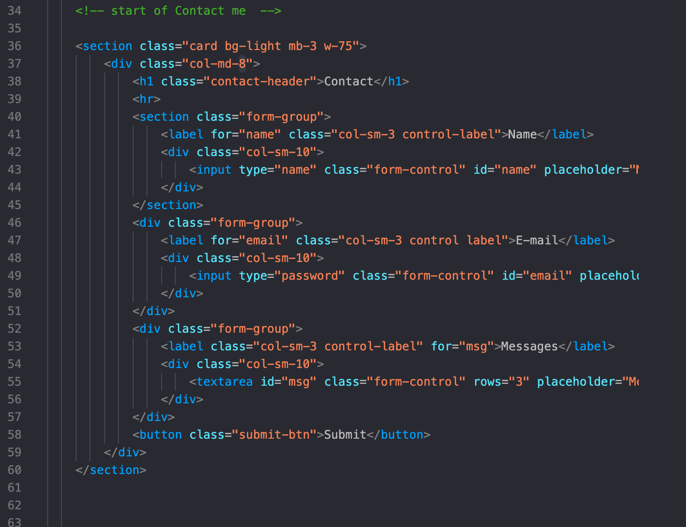

## Isaias's Bio 

Here's my background story of why I went back to school and my expierences.

## Getting Started

These instructions will get you a copy of the project up and running on your local machine for development and testing purposes. See deployment for notes on how to deploy the project on a live system.

### Prerequisites

laptop>

Github account

Terminal for Mac

Gitbash for PC

Download Visual Code Editor

Atom

### Installing
-Create GitHub account

-Go to your terminal and setup GitHub SSH

-Follow this link:https://help.github.com/en/github/authenticating-to-github/adding-a-new-ssh-key-to-your-github-account

-Once you've completed creating ssh here's the link to my porfolio: hhttps://github.com/idelmundo/portfolio

-Clone SSH key and save the file in your desktop or documnet.

-Open terminal and go to the folder you've created for example: <href="https://user-images.githubusercontent.com/64993651/84466315-ff014300-ac2d-11ea-885d-10cfc0ee06e6.png"> from here Visual code should open with the folder on the side bar.

### Steps on what each does

Lines 1-13 it we are telling the browser here's a document type HTML. We also state that we want it to be mobile friendly with line #7. We also linked bootstrap and stylesheet so we can design our website. Here's an example 
  

 

 Next lines 15-29 will be body following navbar. In here you can explore other tabs like About, Portfolio and Contact. In this code I've use the bootstrap nav bar to make things easier and just use a little but of css stylesheet to shift left and right of the page and locked it in place too. The navbars are all the same from each pages. Here's an example: 
  

 

 In following lines about me pg which we used bootstrap container to make a box,row and col to make it mobile friendly so when its can adop it. I was able to use float and the words to wrap on my image using stylesheet.css this will be in my stylesheet.css under index about me. 
 

 

 Once you select Portfolio it will show you my hobbies and imgages heres where it gets tricky due to containers,row, col small-6 medium-6 and large6. They're 5 images total and the layout is 2,2 and 1 I've decided to pick 6 because it has to equal to 12 on each row. They were also suppose to change whena mobile devics or small monitor.
  

 

 On the page Contact the layout I use is also from bootstrap called card/form-group in here youll see name, email and messages. This one was fairly simple since bootstrap had a layout and just had to modify a few things such as names,emails and messages. Also added a submit me button.
   

 

 At the end of every pages you'll see a footer which is pretty basic called out footer and col-md.
   

## Built With

* [HTML](https://developer.mozilla.org/en-US/docs/Web/HTML)
* [CSS](https://developer.mozilla.org/en-US/docs/Web/CSS)
* [Bootstrap](https://getbootstrap.com/)

## Deployed Link

* [See Live Site](#)

## Authors

* **YOUR NAME** 

- [Link to Portfolio Site](#)
- [Link to Github](https://github.com/)
- [Link to LinkedIn](https://www.linkedin.com/)

See also the list of [contributors](https://github.com/your/project/contributors) who participated in this project.

## License

This project is licensed under the MIT License 

## Acknowledgments

* Hat tip to anyone whose code, libraries, packages, or UI was used  / inspired from
* Inspiration
* etc
